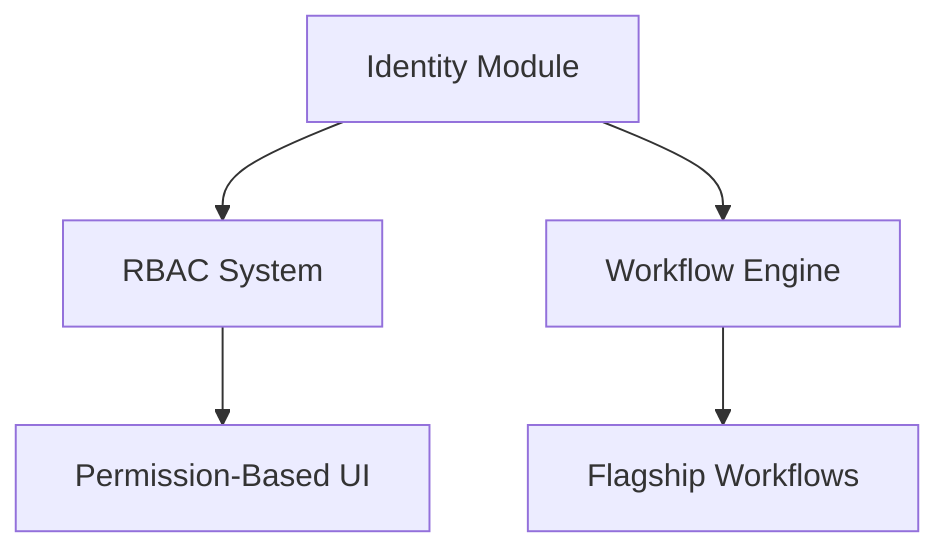

# Gaps & Roadmap

**Purpose**: Track the delta between current state and target architecture  
**Audience**: Technical leaders, product managers, engineers planning work  
**Status**: Living documents - updated as gaps are closed or priorities change

---

## 📋 Overview

This folder captures the **gap analysis** between "as is" (current state) and "should be" (target architecture), prioritized roadmap for closing gaps, and evidence mapping to track implementation progress.

**Philosophy**: "You can't improve what you don't measure." This folder makes architectural debt visible and actionable.

---

## 📚 Documents in This Folder

| Document | Purpose | Read Time | Status |
|----------|---------|-----------|--------|
| [GAP_ANALYSIS.md](GAP_ANALYSIS.md) | Current vs target gaps with priorities | 15 min | ✅ Active |
| [MIGRATION_PLAN.md](MIGRATION_PLAN.md) | Step-by-step roadmap to target state | 10 min | 🟡 Planned |
| [EVIDENCE_MAP.md](EVIDENCE_MAP.md) | Documentation → code evidence mapping | 5 min | 🟡 Planned |

---

## 🎯 What is a Gap?

**Definition**: The difference between current implementation and target architecture.

**Types of Gaps**:

### 1. **Feature Gaps** (Functionality)
Missing features from PLAN.md:
- Workflow engine not implemented
- OIDC integration not built
- Advanced search not available

### 2. **Quality Gaps** (Non-Functional Requirements)
System doesn't meet quality targets:
- Test coverage < 80%
- API latency > 200ms (p95)
- No monitoring dashboards

### 3. **Technical Debt** (Maintainability)
Code that works but needs improvement:
- No database migrations system
- Hardcoded configuration
- Missing error handling

### 4. **Architectural Gaps** (Structure)
Violates target architecture:
- Domain boundaries not enforced
- Cross-domain direct calls
- Shared mutable state

---

## 🏗️ Enterprise Gap Analysis Framework

### Priority Matrix (Impact vs Effort)

```
High Impact, Low Effort   │ High Impact, High Effort
       DO FIRST!          │    PLAN CAREFULLY
─────────────────────────────────────────────────
Low Impact, Low Effort    │ Low Impact, High Effort
      DO LATER            │      AVOID
```

### Gap Prioritization (RICE Scoring)

**RICE** = Reach × Impact × Confidence / Effort

- **Reach**: How many users/systems affected?
- **Impact**: How much improvement? (0.25=minimal, 0.5=low, 1=medium, 2=high, 3=massive)
- **Confidence**: How sure are we? (50%=low, 80%=medium, 100%=high)
- **Effort**: Person-months to implement

**Example**:
```
Gap: Implement RBAC
Reach: 100% of users
Impact: 2 (high - critical security feature)
Confidence: 80% (we know what to build)
Effort: 3 person-months

RICE Score = (100 × 2 × 0.8) / 3 = 53.3
```

### Gap Categories

| Category | Description | Typical Priority |
|----------|-------------|------------------|
| **P0 - Critical** | Blocks production, security risk | Fix immediately |
| **P1 - High** | Core feature gap, performance issue | Next sprint |
| **P2 - Medium** | Nice-to-have feature, minor debt | Next quarter |
| **P3 - Low** | Future enhancement, low-impact debt | Backlog |

---

## 💡 Unique Differentiators

### 1. **Evidence-Based Gap Tracking**

Every gap includes:
- **Current State**: File references showing what exists
- **Target State**: PLAN.md or ADR reference showing what's needed
- **Gap**: Specific difference
- **Evidence**: Exact code location or test showing gap

**Example**:
```markdown
### Gap: No Database Migration System

**Current**: Migrations run manually via SQL scripts
- Evidence: No migrations/ folder, database.ts:15 uses raw SQL

**Target**: Automated migration system (PLAN.md § 3.2)
- Evidence: PLAN.md line 142-156

**Gap**: Need migration tooling (e.g., Drizzle Kit, TypeORM migrations)

**Priority**: P1 (High - required for safe deployments)
**Effort**: 1 week
**Risk**: Without this, schema changes can cause data loss
```

### 2. **Living Roadmap with Automatic Updates**

Roadmap is linked to task management:
- GitHub Issues/Projects track implementation
- Gaps link to specific issues
- Issue closure auto-updates roadmap status
- Dashboard shows real-time progress

### 3. **Dependency-Aware Planning**

**Gap Dependencies Visualized**:


**Planning Impact**: Must implement Identity before RBAC before Permission UI

### 4. **Technical Debt Interest Calculation**

**Pattern**: Calculate cost of NOT fixing debt

**Example**:
```
Gap: Hardcoded Configuration
Current Cost: 
  - 2 hours per deployment to manually update configs
  - 12 deployments/year = 24 hours/year
  - At $100/hour = $2,400/year

Fix Cost:
  - 1 week to implement config system = $4,000
  
Payback Period: 4,000 / 2,400 = 1.67 years
Decision: Fix if planning to maintain for 2+ years
```

### 5. **Continuous Gap Analysis**

**Automated Checks** (CI Pipeline):
- ✅ Test coverage dropped? → New gap
- ✅ Dependency updated? → Verify no breaking changes
- ✅ New TODO comment? → Captured as gap
- ✅ ADR accepted but not implemented? → Gap

---

## 🔍 How to Use Gap Documentation

### Scenario 1: Planning Next Sprint

1. **Read**: [GAP_ANALYSIS.md](GAP_ANALYSIS.md) - All known gaps
2. **Filter**: By priority (P0, P1)
3. **Sort**: By RICE score (highest first)
4. **Check**: Dependencies (what must be done first?)
5. **Select**: Based on team capacity
6. **Update**: Task tracker with selected gaps
7. **Track**: Progress and update gap status

### Scenario 2: Justifying Technical Debt Work

1. **Calculate**: Technical debt interest (cost of not fixing)
2. **Estimate**: Fix cost
3. **Compare**: Payback period
4. **Document**: In [GAP_ANALYSIS.md](GAP_ANALYSIS.md)
5. **Present**: To stakeholders with data
6. **Prioritize**: Against feature work

### Scenario 3: Onboarding - Understanding Limitations

1. **Read**: [GAP_ANALYSIS.md](GAP_ANALYSIS.md) - What doesn't exist yet
2. **Understand**: Current limitations and workarounds
3. **Plan**: How to work around gaps
4. **Avoid**: Building on top of things that will change

### Scenario 4: Architecture Review

1. **Compare**: Implementation vs. [TARGET_ARCHITECTURE.md](../00_plan_intent/TARGET_ARCHITECTURE.md)
2. **Identify**: New gaps
3. **Document**: In [GAP_ANALYSIS.md](GAP_ANALYSIS.md)
4. **Prioritize**: Using RICE scoring
5. **Track**: Add to roadmap

---

## 📊 Gap Metrics Dashboard

### Gap Inventory

| Category | Count | Trend |
|----------|-------|-------|
| **P0 - Critical** | TBD | ⚠️ |
| **P1 - High** | TBD | → |
| **P2 - Medium** | TBD | → |
| **P3 - Low** | TBD | ↗️ |
| **Total Gaps** | TBD | → |

### Closure Velocity

| Metric | Target | Current | Trend |
|--------|--------|---------|-------|
| **Gaps Closed/Month** | > 5 | TBD | → |
| **Avg Time to Close** | < 30 days | TBD | → |
| **Gap Closure Rate** | > 80% | TBD | ⚠️ |

### Technical Debt

| Metric | Value | Alert |
|--------|-------|-------|
| **Total Debt Hours** | TBD | > 1000 hours 🚨 |
| **Debt Interest/Month** | TBD | > $10k ⚠️ |
| **Payback Period** | TBD | > 2 years 🟡 |

---

## 🎓 Gap Analysis Best Practices

### DO:
- ✅ Be specific (not "improve performance" but "reduce API latency from 500ms to 200ms")
- ✅ Include evidence (file references, test results, metrics)
- ✅ Estimate effort objectively (use planning poker, historical data)
- ✅ Update status regularly (weekly for active gaps)
- ✅ Celebrate closures (gamification, team recognition)

### DON'T:
- ❌ Create vague gaps ("code quality issues")
- ❌ Ignore dependencies (implement RBAC before you have users)
- ❌ Forget to archive closed gaps (learn from history)
- ❌ Let gaps go stale (review quarterly, close or update)
- ❌ Prioritize everything as P0 (boy who cried wolf)

---

## 🔗 Related Documentation

- **Parent**: [docs/architecture/README.md](../README.md)
- **Current State**: [docs/architecture/10_current_state/](../10_current_state/)
- **Target State**: [docs/architecture/00_plan_intent/](../00_plan_intent/)
- **Decisions**: [docs/architecture/20_decisions/](../20_decisions/)
- **Task Management**: [tasks/](../../../tasks/)

---

## 📝 Maintenance

**Update Frequency**:
- **Gap additions**: Immediately when discovered
- **Gap updates**: Weekly during sprint
- **Gap review**: Monthly (prioritization review)
- **Roadmap review**: Quarterly (strategic review)

**Owners**: 
- **Gap Identification**: All engineers
- **Gap Prioritization**: Technical Lead + Product
- **Roadmap Planning**: Technical Lead + Engineering Manager

**Last Major Update**: 2026-02-04  
**Next Scheduled Review**: 2026-03-01

---

**Quick Navigation**: [Back to Architecture](../README.md) | [Gap Analysis](GAP_ANALYSIS.md) | [Current State](../10_current_state/README.md) | [Target State](../00_plan_intent/README.md)
