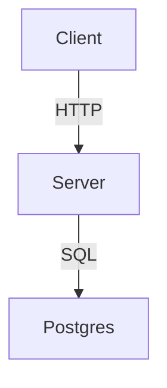

# Architecture Documentation

**Purpose:** Comprehensive architecture documentation for UBOS  
**Audience:** Engineers, architects, technical leaders  
**Goal:** Understand system in <30 minutes, evolve safely

---

## Quick Start

### New Engineer (First Day)
1. Read [CURRENT_ARCHITECTURE_OVERVIEW.md](./10_current_state/CURRENT_ARCHITECTURE_OVERVIEW.md) (10 min)
2. Read [REPO_MAP.md](./10_current_state/REPO_MAP.md) (5 min)
3. Read [TARGET_ARCHITECTURE.md](./00_plan_intent/TARGET_ARCHITECTURE.md) (15 min)
4. **Total:** <30 min to understand current + target state

### Maintainer (Planning Work)
1. Read [GAP_ANALYSIS.md](./60_gaps_and_roadmap/GAP_ANALYSIS.md) (15 min)
2. Check [ADR_INDEX.md](./20_decisions/ADR_INDEX.md) for relevant decisions
3. Update docs as you implement (see "Keeping Docs Updated" below)

### Security Engineer
1. Read [SECURITY_BASELINE.md](./30_cross_cutting/SECURITY_BASELINE.md)
2. Review [../security/](../security/) for detailed security standards

---

## Documentation Structure

```
docs/architecture/
├── README.md (this file)              # Entry point + how to use
├── 00_plan_intent/                    # What we're building
│   ├── PLAN_SUMMARY.md                # Architecture intent from PLAN.md
│   └── TARGET_ARCHITECTURE.md         # Target modular monolith design
├── 10_current_state/                  # What exists now
│   ├── CURRENT_ARCHITECTURE_OVERVIEW.md
│   ├── REPO_MAP.md
│   ├── RUNTIME_COMPONENTS.md
│   ├── BUILD_AND_TOOLING.md
│   ├── CONFIGURATION_MODEL.md
│   └── DEPENDENCY_GRAPH.md
├── 20_decisions/                      # Architecture decisions (ADRs)
│   ├── ADR_INDEX.md
│   ├── ADR_TEMPLATE.md
│   └── ADR-NNNN-<title>.md
├── 30_cross_cutting/                  # System-wide concerns
│   ├── AUTH_AND_SESSION.md
│   ├── SECURITY_BASELINE.md
│   ├── LOGGING_AND_OBSERVABILITY.md
│   ├── ERROR_HANDLING.md
│   └── PERFORMANCE_AND_LIMITS.md
├── 40_interfaces/                     # APIs, integrations, events
│   ├── API_SURFACES.md
│   ├── INTEGRATIONS.md
│   └── EVENTS_AND_JOBS.md
├── 50_deployment/                     # Deployment topology
│   ├── ENVIRONMENTS.md
│   ├── DEPLOYMENT_TOPOLOGY.md
│   └── CI_CD.md
└── 60_gaps_and_roadmap/               # Current → Target delta
    ├── GAP_ANALYSIS.md
    ├── MIGRATION_PLAN.md
    └── EVIDENCE_MAP.md
```

---

## Key Documents

### Current State (As-Is)
| Document | Purpose | Time to Read |
|----------|---------|--------------|
| [CURRENT_ARCHITECTURE_OVERVIEW.md](./10_current_state/CURRENT_ARCHITECTURE_OVERVIEW.md) | High-level system snapshot | 10 min |
| [REPO_MAP.md](./10_current_state/REPO_MAP.md) | Monorepo structure + ownership | 5 min |
| [RUNTIME_COMPONENTS.md](./10_current_state/RUNTIME_COMPONENTS.md) | Processes, entry points, lifecycle | 10 min |

### Target State (To-Be)
| Document | Purpose | Time to Read |
|----------|---------|--------------|
| [PLAN_SUMMARY.md](./00_plan_intent/PLAN_SUMMARY.md) | Architecture intent (from PLAN.md) | 5 min |
| [TARGET_ARCHITECTURE.md](./00_plan_intent/TARGET_ARCHITECTURE.md) | Modular monolith design | 15 min |

### Delta (Gap Analysis)
| Document | Purpose | Time to Read |
|----------|---------|--------------|
| [GAP_ANALYSIS.md](./60_gaps_and_roadmap/GAP_ANALYSIS.md) | Current vs target + priorities | 15 min |
| [MIGRATION_PLAN.md](./60_gaps_and_roadmap/MIGRATION_PLAN.md) | Step-by-step migration roadmap | 10 min |

### Cross-Cutting Concerns
| Document | Purpose | Time to Read |
|----------|---------|--------------|
| [AUTH_AND_SESSION.md](./30_cross_cutting/AUTH_AND_SESSION.md) | Auth model + session management | 5 min |
| [SECURITY_BASELINE.md](./30_cross_cutting/SECURITY_BASELINE.md) | Security controls + assumptions | 10 min |
| [LOGGING_AND_OBSERVABILITY.md](./30_cross_cutting/LOGGING_AND_OBSERVABILITY.md) | Logs, metrics, traces | 5 min |

---

## Keeping Docs Updated

### Definition of "Truth"
**Code + CI are the source of truth.** Documentation describes and explains, but if docs conflict with code, code wins.

### Update Triggers
Update architecture docs when:
- ✅ Adding a new domain module
- ✅ Changing multi-tenancy model
- ✅ Adding/removing external integrations
- ✅ Making architecture decisions (create ADR)
- ✅ Changing build/deployment pipeline
- ❌ Small bug fixes (no doc update needed)
- ❌ UI-only changes (no doc update needed)

### Doc Ownership
| Doc Category | Owner | Review Frequency |
|--------------|-------|------------------|
| Current State | Engineers (on change) | Weekly (spot check) |
| Target State | Architects | Monthly |
| Gap Analysis | PM + Tech Lead | Sprint planning |
| ADRs | Decision maker | Never (immutable) |
| Cross-Cutting | Domain owners | Quarterly |

### How to Update
1. **Find the relevant doc:** Use navigation links at top/bottom of each doc
2. **Edit inline:** Update facts, add evidence (file paths), fix inaccuracies
3. **Update "Last verified":** Change date at top of doc
4. **Link to code:** Always include file path evidence for claims
5. **Commit with context:** Explain _why_ the doc changed in commit message

### Verification Commands
Each doc should end with "Last verified by: <command>". Examples:
```bash
# Verify build system works
npm run build && npm start

# Verify tests pass
npm test

# Verify typecheck
npm run check

# Verify security tests
npm run validate:security

# Verify architecture tests (future)
npm run test:architecture
```

---

## Architecture Decision Records (ADRs)

### When to Create an ADR
Create an ADR for **significant architectural decisions** that:
- Impact multiple domains/teams
- Have long-term consequences
- Involve trade-offs
- Need to be explained to future engineers

**Examples:**
- ✅ "Use Postgres schemas for domain isolation"
- ✅ "Use outbox pattern for event-driven communication"
- ✅ "Use Redis for session storage (not in-memory)"
- ❌ "Use Radix UI for components" (library choice, not architecture)
- ❌ "Add index to `clients.email`" (implementation detail)

### ADR Process
1. Copy [ADR_TEMPLATE.md](./20_decisions/ADR_TEMPLATE.md)
2. Name: `ADR-0001-<short-title>.md` (increment number)
3. Fill out sections: Context, Decision, Consequences
4. Get review from tech lead/architect
5. Commit to `docs/architecture/20_decisions/`
6. Update [ADR_INDEX.md](./20_decisions/ADR_INDEX.md)
7. **ADRs are immutable** (never edit after merge; create superseding ADR if needed)

---

## Diagrams

### Diagram Philosophy
- **ASCII diagrams:** Preferred (editable, diff-friendly, version-controlled)
- **External tools:** Avoid (hard to keep updated, not in repo)
- **Mermaid:** Optional (supported by GitHub markdown)

### Example ASCII Diagram
```
┌─────────────┐      HTTP      ┌─────────────┐
│   Client    │ ──────────────> │   Server    │
│  (React)    │                 │  (Express)  │
└─────────────┘                 └──────┬──────┘
                                       │
                                       │ SQL
                                       ▼
                                ┌─────────────┐
                                │  Postgres   │
                                └─────────────┘
```

### Example Mermaid Diagram
````markdown

````

---

## Evidence-Based Documentation

### Always Cite Sources
Every non-obvious claim must include a file path reference.

**Good:**
```markdown
The storage layer is monolithic ([server/storage.ts](../../../server/storage.ts)).
```

**Bad:**
```markdown
The storage layer is monolithic.
```

### Mark Unknowns Explicitly
If you don't know something, say so and list where to verify.

**Example:**
```markdown
**UNKNOWN:** Session TTL. Verify in [server/session.ts](../../../server/session.ts).
```

### Use Verification Commands
End each doc with commands that prove its accuracy.

**Example:**
```markdown
**Last verified by:** `npm run check && npm test`
```

---

## FAQ

### Q: How do I know which doc to update?
**A:** Use the navigation links at the bottom of each doc. If unsure, update [CURRENT_ARCHITECTURE_OVERVIEW.md](./10_current_state/CURRENT_ARCHITECTURE_OVERVIEW.md) first.

### Q: What if docs conflict with code?
**A:** Code wins. Update the doc to match reality.

### Q: Should I update docs before or after code changes?
**A:** After. Docs describe reality, not intent. Update docs when the code is merged.

### Q: How often should I review docs?
**A:** Spot-check during PR reviews. Full review quarterly.

### Q: Can I delete outdated docs?
**A:** Yes, but move to `archive/` folder (don't lose history).

### Q: What if I don't have time to update docs?
**A:** Mark section as **OUTDATED (YYYY-MM-DD)** and create a GitHub issue to fix later.

---

## Related Documentation

- [PLAN.md](../../../PLAN.md): Master plan (target architecture source)
- [README.md](../../../README.md): Setup instructions (how to run)
- [docs/security/](../security/): Security standards (SOC2, GDPR, etc.)
- [docs/api/](../api/): API documentation (endpoints, contracts)
- [docs/data/](../data/): Data model documentation (ERDs, schemas)
- [docs/tests/](../tests/): Testing documentation (strategies, coverage)

---

## Contributors

This documentation was bootstrapped on **2026-02-04** by automated analysis of the codebase and PLAN.md.

**Maintainers:** All engineers (living documentation)

**Last full review:** 2026-02-04

---

**Next Steps:**
1. Read [CURRENT_ARCHITECTURE_OVERVIEW.md](./10_current_state/CURRENT_ARCHITECTURE_OVERVIEW.md)
2. Read [TARGET_ARCHITECTURE.md](./00_plan_intent/TARGET_ARCHITECTURE.md)
3. Read [GAP_ANALYSIS.md](./60_gaps_and_roadmap/GAP_ANALYSIS.md)
4. Dive into specific topics as needed
